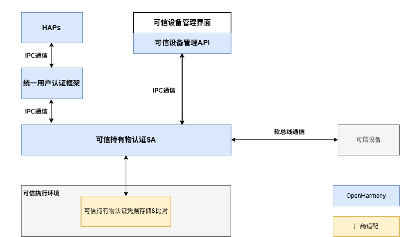

# Companion Device Authentication Component

- [Introduction](#Introduction)
- [Directory](#Directory)
- [Description](#Description)
  - [Interface Description](#Interface Description)
  - [Usage Instructions](#Usage Instructions)
- [Related Repositories](#Related Repositories)


## Introduction

### companion device authentication (companion_device_auth) provides the functionality to authenticate users based on the trusted devices they possess. The authentication process is illustrated in the figure below:

**Figure1** Companion Device Authentication Process
<p>
  
</p>

### Prerequisite for Companion Device Authentication: The device owner has added a specified companion device as their identity authentication credential on the primary device.

### Companion Device Authentication Process:
### 1. The possession (device) confirms that the user currently wearing/holding it is the device owner.
### 2. The primary device confirms that the operation intent originates from the device owner. There are two confirmation methods: one is by confirming the device owner is near the primary device, ensuring the operation is performed under the owner's supervision; the other is to perform real-time owner identity verification on the possession side, or to perform an operation confirmation on the possession side where the user's identity has already been confirmed.

**Table 1** Companion Device Authentication Stages

| Companion Device Authentication Stages | Authentication Method | Description  | Risk
| ------ | ----- |----- | ------ |
| Enroll | Establishment of Trust Relationship Between Devices | The possession device and the primary device must have a user-explicitly-established trust relationship. This relationship proves that both devices belong to the same owner and can be used to securely exchange authentication packets during the authentication phase. | If a trust relationship does not exist between the two devices, the trust foundation for trusted possession authentication is absent. The possession confirming its owner's identity does not prove that the same user is also the owner of the primary device. |
| Auth | Possession Confirms User Identity | Before the possession enters the active authentication state, it must first confirm the identity of the user currently holding it. For example, a smartwatch needs to be unlocked after being worn before it can be used as a trusted possession to unlock the user's phone. | If the possession does not confirm the user's identity before entering the trusted state, anyone who picks up the possession could impersonate the device owner. |
| Auth | Proving Operation Intent Originates from Device Owner | Method 1 (Primary Device Confirms Owner is Nearby): For example, a phone uses watch wear detection + distance measurement to the watch to prove that the owner of the watch is near the phone. | If the operation intent is not confirmed to be from the owner, an impersonator could perform unauthorized operations on the authentication device via possession-based seamless authentication outside the owner's line of sight. |
| Auth | Proving Operation Intent Originates from Device Owner | Method 2 (Possession Confirms User Operation Intent): For example: 1. Prompt the user to perform an immediate identity verification on the possession device side, such as U-key password authentication. 2. The device owner confirms the operation information by clicking a confirmation on the already authenticated/unlocked possession device interface. | If the operation intent is not confirmed to be from the owner, an impersonator could perform unauthorized operations on the authentication device via possession-based seamless authentication outside the owner's line of sight. |

### Companion Device Authentication is a user authentication executor supported by OpenHarmony. According to the resource registration interface defined by the User Authentication Framework, it registers trusted possession authentication-related resource information with the framework and completes the registration, deletion, and authentication of trusted devices based on framework calls.
### Companion Device Authentication Architecture Diagram:

**Figure2** Companion Device Authentication Architecture Diagram:
<p>

</p>

### During the process of the primary device adding a trusted possession device, the primary device and the trusted possession device exchange their respective authentication credentials. These credentials are primarily used to protect the security of information exchanged between the primary device and the trusted possession device during the authentication phase. Therefore, both the primary device side and the trusted possession device side need to securely store and use this credential information.

### The OpenHarmony open-source architecture provides a pure software implementation of Trusted Possession Authentication for developers to demo the functionality. The pure software implementation does not include the secure storage capability for the trusted possession authentication credentials.

## Directory
```undefined
//base/useriam/companion_device_auth
├── common                              # Common header files
├── frameworks                          # Interface frameworks
│   └── ets/ani                         # ETS/ArkUI Native interface implementation
│   └── js/napi                         # JS/NAPI interface implementation
│   └── native                          # Native interface
│       └── client                      # C++ interface implementation
│       └── ipc                         # IPC communication interface (IDL)
├── interfaces/inner_api                # Inner API interfaces
├── param                               # System parameter configuration
├── sa_profile                          # System service startup configuration files
├── services                            # Service implementation
│   └── common                          # Service common header files
│   └── companion                       # Companion device management
│   └── cross_device_comm               # Cross-device communication infrastructure
│   └── cross_device_interaction        # Cross-device business request processing
│   └── fwk_comm                        # UserIAM framework integration adaptation
│   └── host_binding                    # Managed bound primary devices
│   └── misc                            # Miscellaneous utilities
│   └── request                         # Request lifecycle management
│   └── security_agent                  # Security agent layer
│       └── cpp                         # C++ adaptation layer
│       └── rust                        # Rust implementation
│           └── commands                # Command parsing
│           └── common                  # Common data structures
│           └── entry                   # Entry module and initialization
│           └── impls                   # Functional module implementations
│           └── jobs                    # Common mechanisms
│           └── request                 # Request processing
│           └── traits                  # Functional module interfaces
│           └── utils                   # Utility classes
│   └── service_entry                   # Service entry
│   └── singleton                       # Singleton management
│   └── soft_bus_cross_device_channel   # SoftBus channel implementation
│   └── utils                           # Utility classes
├── test                                # Test code
│   └── fuzztest                        # Fuzz test cases
│   └── unittest                        # Unit test cases
```

## Description

### Interface Description

**Table1** Trusted Device Management Interfaces

| Interface Name  | Description                            |
| ------ | -------------------------------- |
| getStatusMonitor(localUserId: int): StatusMonitor | Obtains the device status monitor for the specified user space. |
| StatusMonitor.getTemplateStatus(): Promise<TemplateStatus[]> | Obtains information about already added trusted devices. |
| StatusMonitor.onTemplateChange(callback: TemplateStatusCallback): void | Registers a listener for status changes of added trusted devices. |
| StatusMonitor.offTemplateChange(callback?: TemplateStatusCallback): void | Unregisters the listener for status changes of added trusted devices. |
| StatusMonitor.onAvailableDeviceChange(callback: AvailableDeviceStatusCallback): void | Registers a listener for status changes of online devices that can be added. Mainly used for wearable devices like watches and headphones with wear detection, enabling continuous user identity authentication. |
| StatusMonitor.offAvailableDeviceChange(callback?: AvailableDeviceStatusCallback): void | Unregisters the listener for status changes of online devices that can be added. |
| StatusMonitor.onContinuousAuthChange(param: ContinuousAuthParam, callback: ContinuousAuthStatusCallback): void | Registers a listener for the continuous identity authentication status of the trusted possession. |
| StatusMonitor.offContinuousAuthChange(callback?: ContinuousAuthStatusCallback): void | Unregisters the listener for the continuous identity authentication status of the trusted possession. |

### Usage Instruction
- It is necessary to implement the interfaces defined in the header file services/singleton/inc/security_agent/security_agent.h in as secure an environment as possible to ensure the security of the trusted possession authentication results.

## Related Repositories

**[useriam_user_auth_framework](https://gitee.com/openharmony/useriam_user_auth_framework)**

[useriam_pin_auth](https://gitee.com/openharmony/useriam_pin_auth)

[useriam_face_auth](https://gitee.com/openharmony/useriam_face_auth)

[drivers_peripheral](https://gitee.com/openharmony/drivers_peripheral)

[drivers_interface](https://gitee.com/openharmony/drivers_interface)