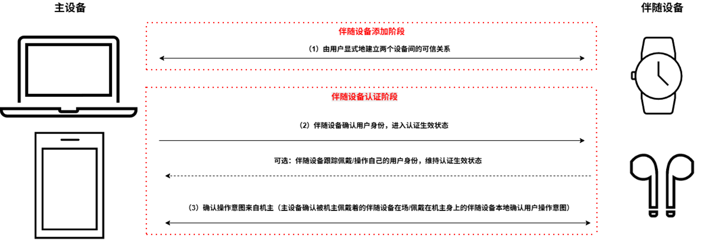
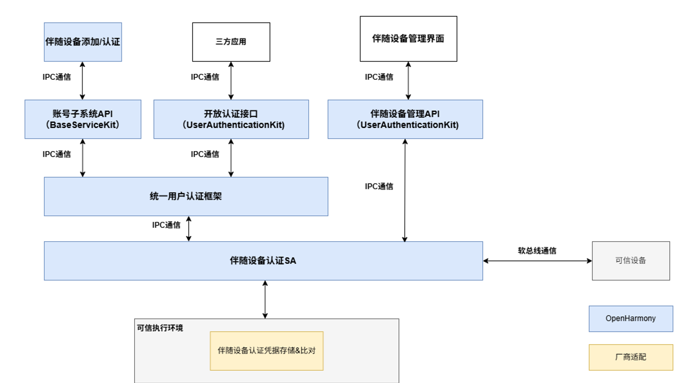

# 伴随设备认证

- [简介](#简介)
- [目录](#目录)
- [说明](#说明)
  - [使用场景描述](#使用场景描述)
  - [接口说明](#接口说明)
  - [使用说明](#使用说明)
- [相关仓](#相关仓)


## 简介

### 伴随设备认证，提供基于用户所持有的可信设备对用户进行身份认证的功能，其认证流程如下图所示：

**图1** 伴随设备认证流程
<p>
  
</p>

### 伴随设备认证前提：机主在主设备上将指定伴随设备添加为自己的身份认证凭据

### 伴随设备认证流程:
### 1. 持有物确认当前佩戴/持有自己的用户是机主本人；
### 2. 主设备确认操作意图来自机主本人。确认方式有两种，一种是通过确认机主在主设备附近，确保操作在机主本人监督下进行；一种是在持有物侧实时做一次机主身份鉴别，或者在已经确认用户身份的持有物侧做一次操作确认。

**表1** 伴随设备认证阶段

| 伴随设备认证阶段 | 认证方式 | 说明  | 风险
| ------ | ----- |----- | ------ |
| 伴随设备添加阶段 | 设备间可信关系的确定 | 持有设备与主设备必须有用户显示建立的可信关系，一方面证明两个设备共机主，另一方面该可信关系可用于两个设备间在认证阶段可信地交换伴随设备认证报文|若两个设备间不存在可信关系，那伴随设备认证的信任基础便不存在，伴随设备确认了自己机主的身份并不能证明该用户同时是主设备的机主 |
| 伴随设备认证阶段 | 伴随设备确认用户身份 | 伴随设备进入认证生效状态前，需先确认当前持有自己的用户身份。如手表佩戴后要先解锁，才能作为伴随设备认证通过解锁用户手机 | 如果伴随设备进入可信状态前没有对用户身份进行确认，那任何捡到伴随设备的人都可以冒充机主身份 |
| 伴随设备认证阶段 | 证明操作意图来自机主本人 | 方式一（主设备确认机主在附近）：例如手机通过手表佩戴检测+手机对手表的测距证明佩戴者手表的机主在手机附近 | 如果没有确认操作意图来自机主，则仿冒用户可能在机主视线范围外通过持有物无感认证，对认证设备进行越权操作 |
| 伴随设备认证阶段 | 证明操作意图来自机主本人 | 方式二（伴随设备确认用户操作意图）：例如：1. 让用户在伴随设备侧立即做一次身份认证，如U盾密码认证 2.机主在已经认证生效的伴随设备侧点击确认，如用户在已经解锁的手表界面确认操作信息 | 如果没有确认操作意图来自机主，则仿冒用户可能在机主视线范围外通过伴随设备无感认证，对认证设备进行越权操作 |

### 伴随设备认证是OpenHarmony支持的一种用户认证执行器，按照统一用户认证定义的资源注册接口，将伴随设备认证相关资源信息注册到统一用户认证框架，并根据框架调完成可信设备的注册、删除和认证。
### 伴随设备认证架构图：

**图2** 伴随设备认证架构图
<p>

</p>

### 主设备添加伴随设备过程中，主设备和伴随设备会交换各自的认证凭据，该凭据主要用于保护认证阶段主设备与伴随设备之间交互信息的安全性。因此，主设备侧和伴随设备侧都需要妥善保存和使用该凭据信息。

### OpenHarmony开源架构内提供了伴随设备认证的纯软件实现，供开发者demo伴随设备认证功能，纯软件实现部分并未包含伴随设备认证凭据的安全存储能力。

## 目录
```undefined
//base/useriam/companion_device_auth
├── common                              # 公共头文件
├── frameworks                          # 接口框架
│   └── ets/ani                         # ETS/ArkUI Native接口实现
│   └── js/napi                         # JS/NAPI接口实现
│   └── native                          # Native接口
│       └── client                      # C++接口实现
│       └── ipc                         # IPC通信接口（IDL）
├── interfaces/inner_api                # Inner API接口
├── param                               # 系统参数配置
├── sa_profile                          # 系统服务启动配置文件
├── services                            # 服务实现
│   └── common                          # 服务公共头文件
│   └── companion                       # 伴随设备管理
│   └── cross_device_comm               # 跨设备通信基础设施
│   └── cross_device_interaction        # 跨设备业务请求处理
│   └── fwk_comm                        # UserIAM框架集成适配
│   └── host_binding                    # 已绑定的主设备管理
│   └── misc                            # 杂项工具
│   └── request                         # 请求生命周期管理
│   └── security_agent                  # 安全代理层
│       └── cpp                         # C++适配层
│       └── rust                        # Rust实现
│           └── commands                # 命令解析
│           └── common                  # 公共数据结构
│           └── entry                   # 入口模块和初始化
│           └── impls                   # 功能模块实现
│           └── jobs                    # 公共机制
│           └── request                 # 请求处理
│           └── traits                  # 功能模块接口
│           └── utils                   # 工具类
│   └── service_entry                   # 服务入口
│   └── singleton                       # 单例管理
│   └── soft_bus_cross_device_channel   # SoftBus通道实现
│   └── utils                           # 工具类
├── test                                # 测试代码
│   └── fuzztest                        # 模糊测试用例
│   └── unittest                        # 单元测试用例
```

## 说明

### 使用场景描述
### 1.伴随设备添加
（1）在 “设置” -> “生物识别和密码” 界面，点击 “伴随设备管理”
（2）弹出本机密码认证界面，输入正确的密码
（3）密码认证成功后，进入伴随设备管理界面，点击“添加新设备”
（4）显示可添加为伴随设备的其他设备，选中任意设备
（5）点击 “添加”，即可将对应设备添加为伴随设备
（6）在伴随设备管理界面可以看到新添加的设备

### 2.伴随设备认证
以手机投屏PC场景为例，在PC被添加为手机的伴随设备的前提下：
（1）手机锁屏后，无法直接在PC侧进行操作
（2）通过伴随设备认证机制，在PC侧进行人脸认证，将PC人脸认证结果流转至手机侧
（3）完成手机侧的用户身份认证，可以在不操作手机的情况下完成手机锁屏解锁

### 3.伴随设备删除
（1）在 “设置” -> “生物识别和密码” 界面，点击 “伴随设备管理”
（2）弹出本机密码认证界面，输入正确的密码
（3）密码认证成功后，进入伴随设备管理界面
（4）选中已经添加为伴随设备的其他设备，弹出删除选项
（5）点击删除，即可删除伴随设备
（6）伴随设备删除后将不再在伴随设备管理界面显示，也不再支持伴随设备认证

### 接口说明

**表1** 可信设备管理接口

| 接口名  | 描述                             |
| ------ | -------------------------------- |
| getStatusMonitor(localUserId: int): StatusMonitor | 获取指定用户空间下的设备状态监视器 |
| registerDeviceSelectCallback(callback: DeviceSelectCallback): void | 注册设备选择回调函数，以提供定制化的设备选择逻辑 |
| unregisterDeviceSelectCallback(): void | 注销当前已注册的设备选择回调函数 |
| updateEnabledBusinessIds(templateId: Uint8Array, enabledBusinessIds: int[]): Promise<void> | 更新指定模板的已启用业务标识符列表，新范围将在返回的 Promise 解析后生效 |
| StatusMonitor.getTemplateStatus(): Promise<TemplateStatus[]> | 获取已经添加的可信设备信息 |
| StatusMonitor.onTemplateChange(callback: TemplateStatusCallback): void | 注册监听已添加的可信设备的状态变化 |
| StatusMonitor.offTemplateChange(callback?: TemplateStatusCallback): void | 注销监听已添加的可信设备的状态变化 |
| StatusMonitor.onAvailableDeviceChange(callback: AvailableDeviceStatusCallback): void | 注册监听在线可添加的设备状态变化 |
| StatusMonitor.offAvailableDeviceChange(callback?: AvailableDeviceStatusCallback): void | 注销监听在线可添加的设备状态变化，主要用于手表、耳机等有佩戴检测的穿戴设备，可持续认证用户身份 |
| StatusMonitor.onContinuousAuthChange(param: ContinuousAuthParam, callback: ContinuousAuthStatusCallback): void | 注册监听可信持有物的持续身份认证情况 |
| StatusMonitor.offContinuousAuthChange(callback?: ContinuousAuthStatusCallback): void | 注销监听可信持有物的持续身份认证情况 |

### 使用说明
- 需在尽可能安全的环境中实现头文件services/singleton/inc/security_agent/security_agent.h中定义的接口，确保可信持有物认证结果的安全性。

## 相关仓

**[useriam_user_auth_framework](https://gitee.com/openharmony/useriam_user_auth_framework)**

**[useriam_pin_auth](https://gitee.com/openharmony/useriam_pin_auth)**

**[useriam_face_auth](https://gitee.com/openharmony/useriam_face_auth)**

**[drivers_peripheral](https://gitee.com/openharmony/drivers_peripheral)**

**[drivers_interface](https://gitee.com/openharmony/drivers_interface)**